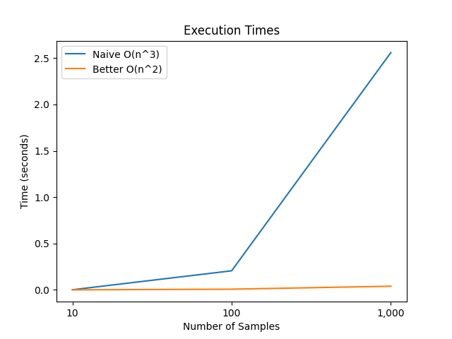

# FindLets
Find triplets of three that sum to zero.

### Problem Description

Identify tuple of 3 elements in an array of integers (positive, negative and zero)
that have sum value of 0. The detected tuples should not have duplicates. 
The output of program should print the identified tuples.

Example:
```
array = [-5,-2,-5,0,5,5,2]

Output should be -> [-5,0,5], [-2,0,2]
Total -> 2 tuples
```
### Requirements

Tested with the following setup using

```
python3 == 3.8 (>= 3.6)
numpy == 1.21.2
tqdm == 4.62
matplotlib == 3.5.1
```

### Usage

```
python3 main.py [--naive|--better] --numbers 50 --from_file inputs.csv --gen_file inputs.csv

ARGS:
----
--naive: A naive finder approach with time complexity O(n^3).
--better: Improved finder approach with time complexity O(n^2).
--help: prints this msg.

KWARGS:
-------
--numbers: Generate N numbers between -9 to 9 and print unique triplets.
--from_file: A file where each line has comma separated numbers.
                            Overrides --number flag.
--gen_file: Only generates a file. Overrides all other flags. Does not execute the finders.
            Example: Following command will generate inputs.csv file with 10 rows and 30 cols
            python3 --genfile inputs.csv 10 30 

Example: 

The following line generates 30 rows of fixed length 10 and then executes better finder on it
python3 main.py --better --numbers 30

The following line creates a csv file with 10 rows and 20 cols, and places inside insputs.csv
python3 main.py --gen_file inputs.csv 10 20

The following line executes better on each line within inputs.csv
python3 main.py --better --from_file inputs.csv

```

### Testing

All tests can be launched using:

```bash
python3 test.py
```

### Complexity Analysis

The finder functions used to search satisfactory triplets can be found in file ```find_triplets.py```. The ```naive_finder()``` has a time complexity of O(n^3), whereas the ```better_finder()``` has the time complexity of O(n^2). The ```better_finder``` trades the inner most loop with a hash-based method. Both finders have the space complexity of O(n). More details are captured in the inline documentation of the functions.

### Plotting Execution time

#### **Experimental Setup:**
The following experiment is test number ```3``` on ```test.py```. See Testing above to execute it. 
*  Executed both alogoriths on list of numbers with lengths 10, 100, 1_000
*  Each of the executions above was averaged over 5 times
*  Results were plotted as shown below

#### **Experimental Results:**

The line plot below describes the execution time in seconds (Y-axis: lower is better) with respect to increasing sample length (X-axis) for the ```Naive``` and ```Better``` zero sum triplet finding algorithms.



From the results, it is evident that ```Better``` algorithm considerably outperforms the ```Naive``` algorithm due the complexity as descibed in the figure legend.

